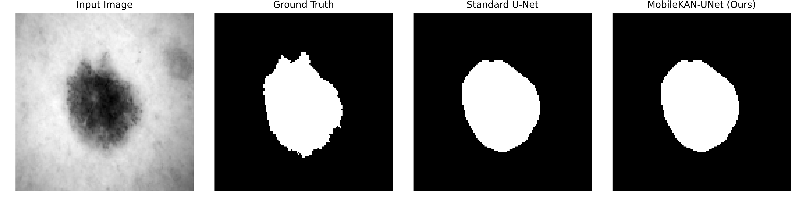

# MobileKAN-UNet: Lightweight Medical Image Segmentation

This repository contains the official implementation of the paper:
**"MobileKAN-UNet: A Lightweight Hybrid Architecture with Depthwise Separable Convolutions and Kolmogorov-Arnold Bottlenecks for Real-Time Lesion Segmentation"**

## 🏆 Results (ISIC 2018 Dataset)
| Model | Params (M) | GFLOPs | Dice Score |
| :--- | :---: | :---: | :---: |
| Standard U-Net | 17.26 | ~5.20 | 0.8467 |
| **MobileKAN-UNet (Ours)** | **0.03** | **0.06** | **0.8655** |

## 🖼️ Visual Comparison

## 🚀 Usage
1. Open the `MobileKAN_UNet.ipynb` notebook.
2. The dataset will download automatically via the Kaggle API.
3. Run the cells to reproduce the training and evaluation.

## 📄 Architecture
We replace standard convolutions with **Depthwise Separable Convolutions** in the encoder and introduce a **Kolmogorov-Arnold Network (KAN)** layer in the bottleneck to capture non-linear features efficiently.
